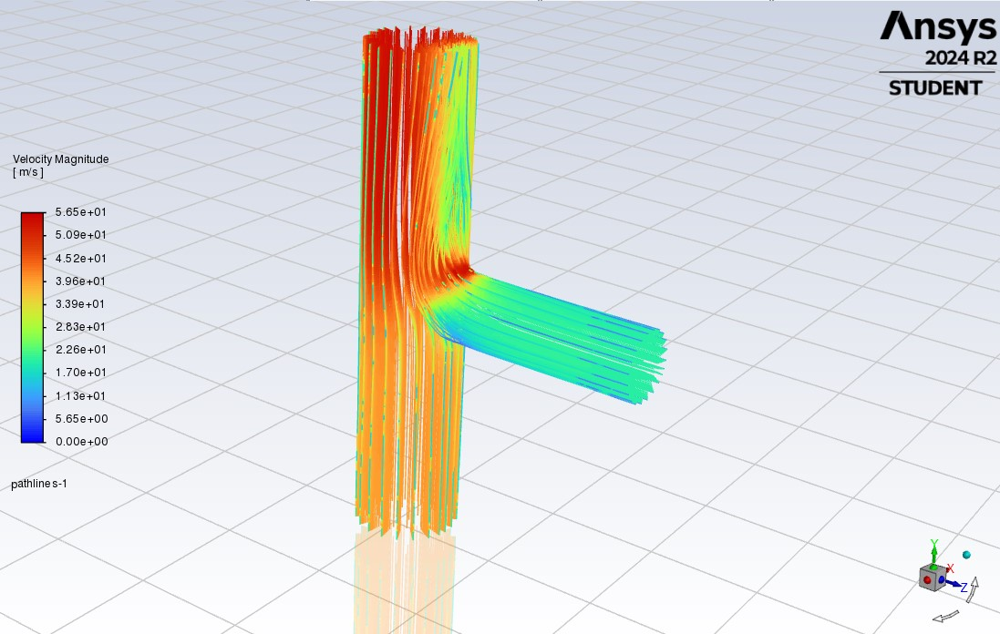
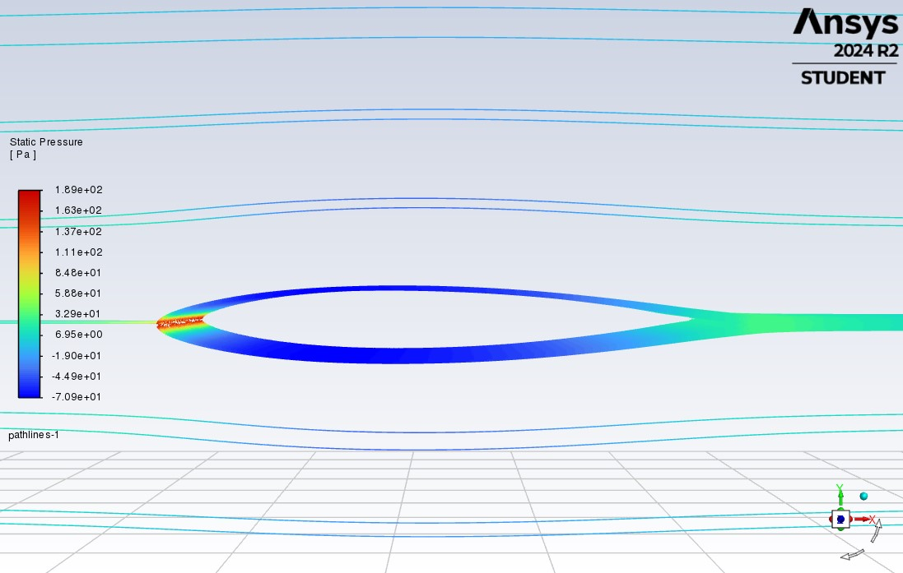

# CFD Studies: NACA 0012 Airfoil and T-Junction Pipe Flow

*Team of 3 · AE 301 Aerodynamics · Izmir University of Economics · December 2024*

## Engineering question
Two ANSYS Fluent studies, each checked against theory:
1. **T-junction pipe (Homework 3):** in a T-junction with two water inlets and one outlet, does the simulated outlet velocity match the value predicted by mass conservation, and where are the pressure extremes?
2. **NACA 0012 airfoil (Homework 4):** does a CFD simulation of a symmetric airfoil at 0° angle of attack reproduce the expected symmetric pressure distribution and negligible lift?

## Approach
**T-junction (incompressible water flow)**
- Geometry measured in SpaceClaim: inlet 1 diameter 101.6 mm at 20 m/s, inlet 2 diameter 152.4 mm at 40 m/s, outlet diameter 152.4 mm as a pressure outlet (0 Pa gauge).
- Theoretical outlet velocity from mass conservation: Vout = (A1V1 + A2V2) / Aout = 48.889 m/s.
- ANSYS Fluent: k-ω SST turbulence model with tabulated wall treatment, second-order upwind discretisation, under-relaxation factors of 0.25 (momentum) and 0.5 (k, ω).
- Tetrahedral mesh with inflation layers: 73,663 nodes, 32,398 elements, average skewness 0.26.
- Residual target 10-3, reached after 375 iterations.

**NACA 0012 airfoil (air, 0° angle of attack)**
- Airfoil coordinates from airfoiltools.com, scaled to a 140 mm chord (90 mm span) and imported into ANSYS DesignModeler.
- Rectangular domain about 5 chords upstream and 10 chords downstream, with symmetry boundaries.
- Hybrid patch-conforming tetrahedral mesh with 10 inflation layers (growth rate 1.2, maximum thickness 16.8 mm = 0.12c), 1.4 mm (c/100) face sizing and 200 edge divisions.
- Steady incompressible flow, k-ω SST, pressure-based coupled solver with second-order discretisation, inlet velocity 19 m/s, standard air.
- Residual target 10-4, reached after 66 iterations.

## Results
- **T-junction:** the simulated area-weighted outlet velocity is **48.740 m/s**, against 48.889 m/s from theory, a **0.3 %** difference. The highest pressures occur upstream of the junction (stagnation) and the lowest just downstream of the branch, where the merging flows accelerate.
- **NACA 0012:** the pressure distribution is nearly symmetric about the chord line, with stagnation at the leading edge and symmetric acceleration over both surfaces. The flow stays attached with a thin, straight wake, giving negligible net lift, as expected for a symmetric airfoil at 0° angle of attack.

## Validation
- T-junction: CFD outlet velocity compared with the mass-conservation result (0.3 % difference). The report attributes the gap to numerical diffusion, turbulence modelling and mesh resolution.
- NACA 0012: qualitative comparison with the theory of a symmetric airfoil at zero incidence (no net lift, symmetric pressure field).

## Figures

*T-junction: pathlines coloured by velocity magnitude, showing the two inlet streams merging toward the outlet (Homework 3).*

*NACA 0012 at 0° angle of attack: static pressure on the airfoil surface with pathlines (Homework 4).*

*Figure 1: Pressure contour plot over the airfoil surface. Figure 2: Streamlines showing pressure flow patterns around the airfoil (Homework 4).*

## Repository contents
| Path | Content | Opens with |
|---|---|---|
| `report/AERODYNAMICS_3.pdf` | Homework 3: ANSYS simulation and flow analysis of a T-junction pipe | Any PDF reader |
| `report/AERODYNAMICS_4.pdf` | Homework 4: ANSYS CFD simulation of a NACA 0012 airfoil | Any PDF reader |
| `figures/` | Fluent post-processing images | Image viewer |

## How to reproduce
The ANSYS project files are not included. Each report gives the full setup (geometry, mesh settings, models, boundary conditions, solver settings and convergence criteria), so both cases can be rebuilt in **ANSYS Workbench** with SpaceClaim or DesignModeler, ANSYS Meshing and ANSYS Fluent. We used ANSYS 2024 R2 Student.

## Team and my contribution
Team project with **Kaoutar Ammara**, **Sena Güven** and **Sila Arslan** (names as in the reports), AE 301 Aerodynamics.

## References
ANSYS Fluent User Guide; White, *Fluid Mechanics*, 7th ed. (2011); Pope, *Turbulent Flows* (2000); Abbott & von Doenhoff, *Theory of Wing Sections* (1959); Anderson, *Fundamentals of Aerodynamics* (2010); airfoiltools.com airfoil plotter.

---
Kaoutar Ammara · Aerospace Engineer · [GitHub](https://github.com/Kiwiiiieee) · [LinkedIn](https://linkedin.com/in/kaoutar-ammara)
